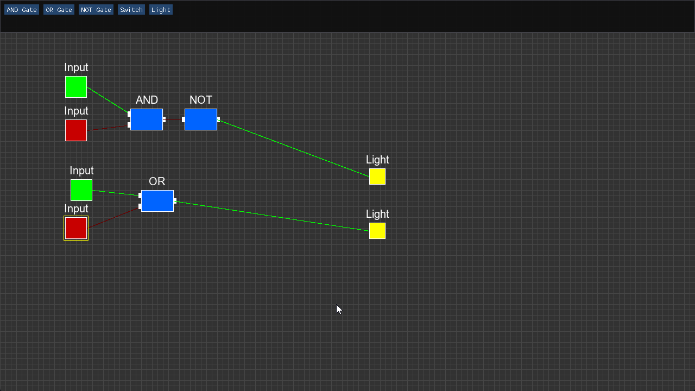

# Digital Logic Simulator

A high-performance logic circuit simulator built in C++ from scratch. This tool allows users to place logic gates, wire them together, and simulate digital circuits in real-time.

 

## 🚀 Features
* **Real-time Simulation:** Circuits update instantly as you toggle inputs.
* **Components:** AND, OR, NOT Gates, Input Switches, Output Lights.
* **Interactive UI:** Drag-and-drop toolbox using Dear ImGui.
* **Smart Wiring:** Click-to-connect wiring system with safety validation.
* **Grid Snapping:** Auto-alignment for neat circuit design.
* **Engine:** Custom engine built on SDL3.
* **Save & Load System:** Persist your circuits to JSON files to continue your work later.

## 🛠️ Dependencies
* **Language:** C++17 or later
* **Graphics:** SDL3 & SDL3_ttf
* **UI:** Dear ImGui
* **Build System:** CMake

## 📦 How to Build (Windows)
1.  **Clone the repository:**
    ```bash
    git clone https://github.com/owaseraph/Digital_Logic_Sim.git
    cd Digital_Logic_Sim
    ```

2.  **Run the Build Script:**
    Simply double-click **`build.bat`**. 
    
    *Alternatively, run manually:*
    ```bash
    cmake -S . -B build -DCMAKE_BUILD_TYPE=Release
    cmake --build build --config Release
    ```

3.  **Run the Simulator:**
    The executable will be located in: `build/Release/Digital_Sim.exe`

## 🎮 Controls
* **Left Click:** Select component / Place wire.
* **Click & Drag:** Move component (snaps to grid).
* **Delete / Backspace:** Delete selected component.
* **UI Toolbar:** Click buttons at the top to spawn gates.
* **Toolbar:** Top bar for spawning components and Saving/Loading circuits.

## 💾 Saving & Loading
* **Save:** Click the **SAVE** button in the top-right corner. This writes the current circuit state to `circuit.json` in the program's directory.
* **Load:** Click **LOAD** to wipe the current canvas and restore the circuit from `circuit.json`.


## 📝 License
This project is for educational purposes.